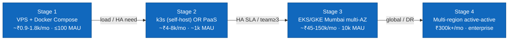

# INFRA-TOPOLOGY.md — deployment routes, networking & infrastructure

> The cloud / hybrid / self-hosted **routes** a generated service can take, the **networking & trust
> boundaries**, and the **infra-as-code** discipline — staged by growth so you never over-provision.
> Inherits [PRINCIPLES.md](PRINCIPLES.md) (cost-effective, self-hostable-first, India-resident,
> swappable). Per-subsystem logical placement maps onto the [ARCHITECTURE.md](ARCHITECTURE.md) port
> catalog; CI/CD that deploys these is [CICD-PIPELINE.md](CICD-PIPELINE.md). Researched 2025-2026,
> cited inline; treat exact prices as order-of-magnitude.

---

## 1. Principle: match topology to stage, not to ambition

The single biggest infra cost mistake is reaching for Kubernetes/multi-region before you have the
load or the ops headcount. The discipline: **start on one box; graduate only when a real constraint
(scale, HA SLA, team size) forces it.** Each route is a *seam* — the app is a 12-factor container, so
moving up a tier is a deploy-target change, not a rewrite.



| Stage | Route | When | Postgres | DR posture |
|---|---|---|---|---|
| **1** | 1 VPS + Docker Compose | MVP, ≤100 MAU, 0-1 ops | self-host + WAL→object store | nightly backup + manual restore |
| **2** | **k3s** on 3 nodes (self-host) *or* **PaaS** (Fly.io has a Mumbai region) | traction, ~1k MAU, 1-2 ops | dedicated node + WAL→S3, *or* managed (Neon/Cloud SQL) | replica + PITR |
| **3** | **EKS (ap-south-1)** or **GKE (asia-south1)** multi-AZ | HA SLA, ~10k MAU, team ≥3 | RDS/Cloud SQL multi-AZ (RPO≈0) | auto-failover + PITR |
| **4** | multi-region active-active or on-prem | enterprise/regulated | cross-region replicas | active-active + global LB |

**Cost-lean default:** GKE `asia-south1` (~15% cheaper than AWS Mumbai) or the **hybrid** sweet spot —
self-host the app tier on k3s + managed Postgres (Neon/Cloud SQL) + Cloudflare R2 (zero-egress) — at
~₹50-80k/mo for Stage-3 scale.

---

## 2. Per-subsystem placement (where each port/component lives)

| Subsystem (port) | Stage 1 (VPS) | Stage 2 (k3s/PaaS) | Stage 3 (EKS/GKE) |
|---|---|---|---|
| **API** (`app.main`) | container | Deployment + HPA | multi-AZ Deployment + HPA |
| **Worker** (arq/DBOS) | systemd/compose | StatefulSet/Deployment | autoscaled Deployment |
| **Realtime** (P27) | same process | Deployment (sticky-ish) + Redis pub/sub | Deployment behind WS-aware LB |
| **MCP server** (`/mcp`) | same process | same Deployment (stateless HTTP) | same; scales with API replicas |
| **Postgres** (RLS + pgvector) | self-host + WAL→R2 | dedicated node *or* managed | **RDS/Cloud SQL multi-AZ + PITR** |
| **Redis** (cache/queue/pubsub/denylist) | self-host | managed/standalone | ElastiCache/Memorystore multi-AZ |
| **Object storage** (StoragePort) | **Cloudflare R2** (zero egress) | R2 | R2 + S3 ap-south-1 edge cache |
| **Observability** (OTLP) | single-node Grafana stack | Helm (Prom/Loki/Tempo) | managed (AMP/Grafana Cloud/Axiom) |
| **Secrets / KMS** (SecretsPort) | `.env` on encrypted disk | Sealed-Secrets / ESO | cloud Secret Manager + KMS (India region) |
| **Ingress / TLS** | nginx/Traefik + Let's Encrypt | Traefik + cert-manager | ALB/GCLB + cert-manager |

---

## 3. Networking & trust boundaries

```mermaid
flowchart TB
    net([Internet]):::ext
    subgraph PUB["Public subnet"]
      ing[Ingress: Traefik/ALB\nTLS termination - Let's Encrypt/ACM]
    end
    subgraph PRIV["Private subnet (no public IP)"]
      app[API / Worker / MCP / Realtime pods]
      pg[(Postgres)]
      rd[(Redis)]
    end
    egw[Egress: NAT + allowlist\n+ SSRF guard P1]:::g
    net -->|443| ing
    ing -->|cluster DNS| app
    app -->|5432 sslmode=require| pg
    app -->|AUTH/TLS| rd
    app -->|outbound: providers only| egw --> net
    classDef ext fill:#999,color:#fff; classDef g fill:#b71c1c,color:#fff;
```

**Boundaries & rules:**
- **Ingress:** only 443 public; TLS at the edge (cert-manager + Let's Encrypt, or ACM). Validate the
  `Origin` header on MCP POSTs (DNS-rebinding defense).
- **Datastores are never public** — Postgres/Redis live in the private subnet; access via cluster DNS +
  security-group/network-policy (app CIDR → 5432/6379 only). `sslmode=require` to Postgres; Redis AUTH.
- **Egress is allowlisted** — outbound restricted to the provider endpoints the ports need
  (payments/LLM/notify/storage/observability); everything else denied. The **SSRF guard (P1)** governs
  *application-level* egress for user-supplied URLs (webhooks, agent tools) — the network policy and the
  app guard are two independent layers (P6 defense-in-depth).
- **mTLS / service mesh** (Linkerd preferred over Istio for ops weight) is **Stage 3+ only, and only if
  justified** — pod-to-pod TLS + L4 policy. At Stage 1-2 it's over-engineering (single VPC, TLS at the
  edge suffices).
- **Secrets** flow via Sealed-Secrets (cluster-local key, portable) or External-Secrets-Operator → a
  cloud Secret Manager/KMS (the `SecretsPort`/KMS seam, P14/P15). Bastion/`kubectl port-forward` for
  break-glass DB access, never a public DB port.

---

## 4. India residency (DPDP 2023) — a real constraint on topology

- **Strict residency ⇒ India-region infra:** **AWS `ap-south-1` (Mumbai)/`ap-south-2` (Hyderabad)** or
  **GCP `asia-south1` (Mumbai)/`asia-south2` (Delhi)**, or on-prem India. **Caveat: Hetzner has no India
  DC** (EU only) and DigitalOcean's nearest is Singapore — both are *cross-border* and need explicit
  Data-Principal consent (or are disqualifying for sensitive PII). Cheapest-isn't-free here.
- **Encryption at rest + in transit is mandatory;** enforce via IaC policy (every DB `storage_encrypted`,
  every bucket public-access-blocked, region pinned).
- **Cross-region replicas for DR are allowed with disclosure** (document as secondary DR backup).
- This pins the **KMS/secrets/silo** adapters (P12/P14/P15) to India regions and is part of decision
  **D2** in [DECISIONS-NEEDED.md](DECISIONS-NEEDED.md).

---

## 5. Environments, release & DR

- **Parity (12-factor):** same image + `uv.lock`, config externalized, migrations run before deploy,
  structured logs/OTel in every env. **dev** (Compose/Minikube) → **staging** (1-node k3s / micro
  managed PG, Let's-Encrypt-staging) → **prod** (multi-AZ) → **preview** (per-PR ephemeral, optional).
- **Release:** **blue-green** for migrations/breaking changes (atomic ingress switch, keep old for
  rollback); **canary** (Flagger + Linkerd/Traefik, observability-gated 10→50→100%) for behavioral
  changes. Both ride the GitOps controller.
- **DR / backups:** Postgres **multi-AZ (RPO≈0) + PITR** (automated backups + WAL archiving to object
  store); Redis replica/Cluster failover; app state is stateless (readiness probes + LB). `velero` for
  cluster-state backup. Retention windows per DPDP (don't keep indefinitely) — ties to P20 backup/retention.

---

## 6. Infra-as-code & GitOps (the discipline)

- **IaC:** **OpenTofu** (or Terraform) for cloud/VPC/DB/cluster — region pinned + policy-as-code
  guardrails (encryption on, region locked, public-access blocked) to make DPDP/residency *enforced,
  not hoped*. **Helm + Kustomize** for app manifests (env overlays). Pulumi if the team prefers Python.
- **GitOps:** **ArgoCD** (UI, larger community) or **Flux** (lighter, good for k3s) reconciles cluster
  state from Git; rollback = `git revert`. Environment parity is a property of the repo, not tribal
  knowledge.
- **Everything in version control:** infra, manifests, policies, and the **deployment diagram** for each
  stage (Mermaid, per [SYSTEM-DESIGN.md](SYSTEM-DESIGN.md) conventions). No click-ops.

---

## 7. How this binds to the roadmap

This doc is the **deployment substrate** the phases run on; it is *not* itself a feature phase. Each
phase's per-phase template ([SDLC.md](SDLC.md)) requires a **deployment/IaC note** (what it adds to the
topology — a new dependency, a network rule, a secret, a migration) and the corresponding
[TRACEABILITY.md](TRACEABILITY.md) rows (requirement → infra change → environment → rollback). The
platform's own CI ([CICD-PIPELINE.md](CICD-PIPELINE.md)) is where `tofu plan`, image scan/sign, and the
GitOps sync gate live. Stage selection (D-series infra decisions) is a founder call captured in
[DECISIONS-NEEDED.md](DECISIONS-NEEDED.md) (D2 residency/hosting).
