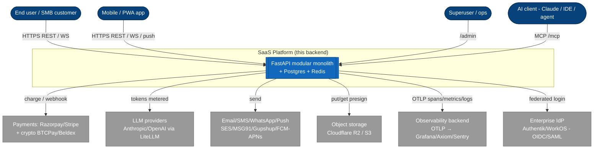
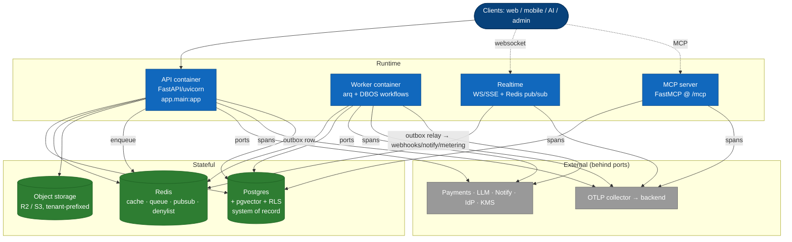
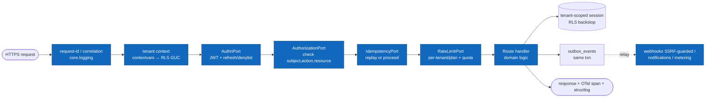
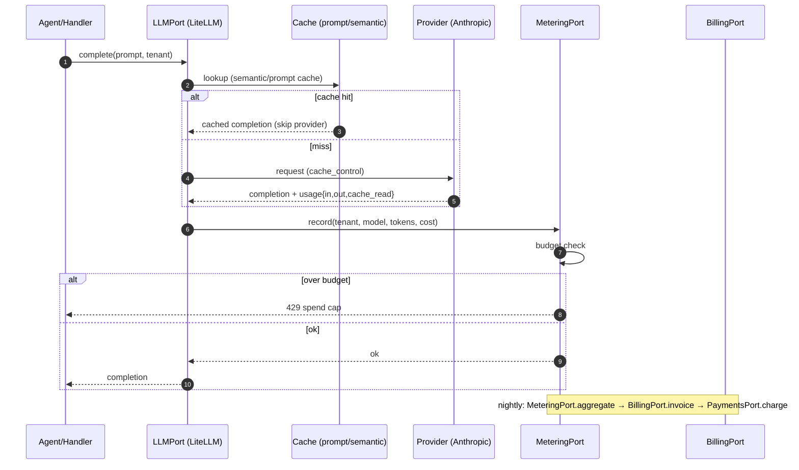
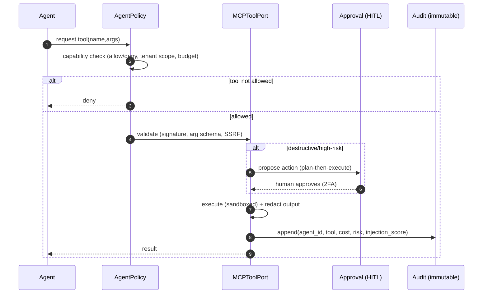
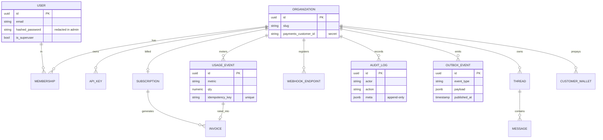

# SYSTEM-DESIGN.md — C4 + sequence + ER diagrams (diagrams-as-code)

> The platform's design rendered as **versioned diagrams-as-code** (Mermaid, so they review in PRs and
> render on GitHub). Follows the **C4 model** (Context → Container → Component) + key **sequence** flows
> + an **ER** overview. This is the *platform-level* design; **every ROADMAP phase ships its own
> phase-level C4-component + sequence + ER-delta diagrams** in the same notation (enforced by the
> per-phase template in [SDLC.md](SDLC.md), traced in [TRACEABILITY.md](TRACEABILITY.md)). Deployment /
> networking topology lives in [INFRA-TOPOLOGY.md](INFRA-TOPOLOGY.md). Inherits
> [PRINCIPLES.md](PRINCIPLES.md); catalog in [ARCHITECTURE.md](ARCHITECTURE.md).

**Diagram conventions.** Mermaid in markdown is the default (zero-tooling, PR-reviewable, GitHub-native).
For a navigable model-as-a-whole, the **Structurizr DSL** (one model → many auto-consistent views) is
the documented upgrade seam; PlantUML is the heavier alternative. One source of truth per diagram; no
binary/Visio. Diagram types per the C4 model + UML sequence/state + ER.

---

## C4 L1 — System context

Who/what uses the platform and what it depends on.



---

## C4 L2 — Containers

The deployable/runtime units. The monolith is one process; the dashed boxes are the logical planes
from [ARCHITECTURE.md](ARCHITECTURE.md).



---

## C4 L3 — Component view: the request pipeline

The middleware/port chain a mutating request traverses (mirrors ARCHITECTURE §2). Each box is a
component owned by a capability module + its phase.



---

## Sequence — authenticated, tenant-isolated request (with RLS backstop)

```mermaid
sequenceDiagram
    autonumber
    participant C as Client
    participant API as FastAPI
    participant A as AuthnPort
    participant Z as AuthorizationPort
    participant DB as Postgres (RLS)
    C->>API: request + JWT
    API->>A: validate token (denylist check)
    A-->>API: user, tenant_id, roles
    API->>API: set contextvar tenant_id
    API->>Z: check(user, action, resource)
    Z-->>API: allow
    API->>DB: BEGIN; SET LOCAL app.current_tenant = tenant_id
    API->>DB: SELECT ... (app-level WHERE org_id) 
    Note over DB: RLS policy independently filters by current_tenant<br/>(defense-in-depth — leak-proof even if WHERE is missed)
    DB-->>API: rows (this tenant only)
    API-->>C: 200 + OTel span + structlog(trace_id)
```

## Sequence — usage-metered LLM call → billing (the AI unit-economics path)



## Sequence — reliable side-effect via transactional outbox + SSRF-guarded webhook

```mermaid
sequenceDiagram
    autonumber
    participant H as Handler
    participant DB as Postgres
    participant R as Outbox relay (worker)
    participant G as SSRF egress guard
    participant EP as Tenant endpoint
    H->>DB: BEGIN; write state + INSERT outbox_events; COMMIT
    Note over H,DB: single transaction — no dual-write loss
    R->>DB: poll unpublished outbox rows
    R->>G: resolve+pin target URL
    alt private/metadata IP
        G-->>R: REJECT (logged)
    else public
        G-->>R: ok
        R->>EP: POST signed (HMAC) payload
        EP-->>R: 2xx
        R->>DB: mark published (idempotent on event_id)
    end
```

## Sequence — agent tool call gated by AgentPolicy + human-in-the-loop (P29)



---

## ER overview — core data model (representative; per-capability deltas ship with each phase)



---

## How phases extend this

Every ROADMAP phase delivers, in this same notation (gated by [SDLC.md](SDLC.md) Definition-of-Done):
a **C4 component** diagram for its module, a **sequence** diagram for its primary flow, and an **ER
delta** for any new tables — each cross-linked from its [TRACEABILITY.md](TRACEABILITY.md) rows. The
platform diagrams above are the always-current "you are here"; phase diagrams are the granular detail.
No phase is "done" until its diagrams + traceability rows merge with the code.
